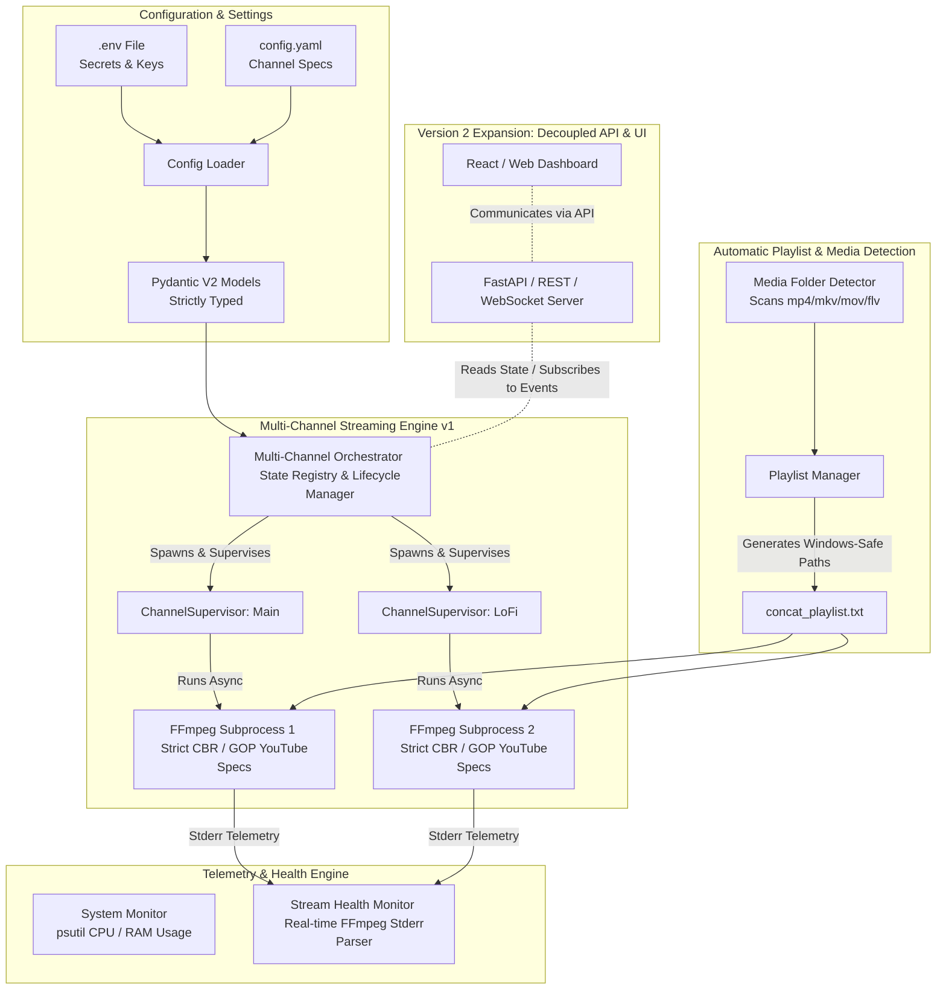

# Mirza Live Server — Architectural Specification (v1 Core & v2 Expansion)

Mirza Live Server is an enterprise-grade, asynchronous 24/7 YouTube livestreaming engine built in Python 3.12+.
Version 1 focuses **strictly on the robust streaming engine**, automatic media folder detection, process supervision, and real-time hardware/stream telemetry. The architecture is explicitly decoupled to allow zero-friction integration of a REST/WebSocket API and Dashboard in Version 2.

---

## 1. High-Level Architecture Diagram



---

## 2. Core Architectural Principles

1. **Strict Decoupling of State & Business Logic**:
   - The streaming engine (`Orchestrator` and `ChannelSupervisor`) operates autonomously.
   - It maintains an in-memory `StateRegistry` (channel status, uptime, current video playing, restarts, CPU/RAM usage, and stream health metrics).
   - In **v2**, external interfaces (API / Dashboard) will simply query this `StateRegistry` and dispatch command events (`start`, `stop`, `skip_video`) without modifying the internal engine loops.

2. **Zero Hardcoded Secrets & Explicit Typing**:
   - Every configuration parameter is validated at startup via **Pydantic V2 Models**.
   - Stream keys are injected via environment variable placeholders (`${YOUTUBE_STREAM_KEY_MAIN}`) loaded safely from `.env`.
   - All file paths use `pathlib.Path` with explicit forward-slash conversion for cross-platform and Windows FFmpeg compatibility.

3. **Autonomous Process Supervision & Self-Healing**:
   - Livestreaming to YouTube requires continuous 24/7 reliability. Network hiccups or malformed frames can cause FFmpeg to drop out.
   - `ChannelSupervisor` monitors the child `FFmpegProcess` inside an async loop (`asyncio`).
   - If an unexpected exit (`exitcode != 0`) occurs, the supervisor logs the crash reason, calculates exponential backoff (`retry_delay_seconds`), regenerates the dynamic playlist if needed, and automatically restarts the stream.

---

## 3. Module Responsibilities & Folder Structure

```
mirza_live_server/
├── src/
│   └── mirza/
│       ├── __init__.py
│       ├── logger.py             # Colored console & per-channel rotating file logging
│       ├── cli.py                # Command-line interface entrypoints
│       │
│       ├── config/               # Configuration & Validation Layer
│       │   ├── __init__.py
│       │   ├── models.py         # Pydantic models (ChannelConfig, VideoEncoding, etc.)
│       │   └── loader.py         # YAML & Environment variable resolution engine
│       │
│       ├── monitor/              # Telemetry & Health Monitoring Layer
│       │   ├── __init__.py
│       │   ├── system.py         # psutil hardware monitor (CPU %, RAM MB/%)
│       │   └── health.py         # Real-time FFmpeg stderr telemetry parser (FPS, bitrate, speed)
│       │
│       ├── playlist/             # Media Management & Windows Path Safe Layer
│       │   ├── __init__.py
│       │   ├── item.py           # Media file model with validation
│       │   ├── detector.py       # Automatic Media Folder Detection (scans & monitors folders)
│       │   └── manager.py        # Playlist manager (shuffles, loops, safe concat.txt builder)
│       │
│       └── engine/               # Core Streaming & Supervision Layer
│           ├── __init__.py
│           ├── ffmpeg_cmd.py     # YouTube-compliant FFmpeg command builder
│           ├── supervisor.py     # Single-channel async supervisor & backoff controller
│           └── orchestrator.py   # Multi-channel orchestrator & v2 state registry
│
├── tests/                        # Comprehensive unit tests for all core modules
└── logs/                         # Auto-created rotating log directory
```

---

## 4. Key Subsystem Specifications

### A. Automatic Media Folder Detection (`src/mirza/playlist/detector.py`)
- **Responsibility**: Eliminates the need for manual text playlists.
- **Behavior**: Given a directory (e.g., `media/channel_main`), `MediaDetector` recursively scans for supported video extensions (`.mp4`, `.mkv`, `.mov`, `.flv`, `.ts`).
- **Dynamic Reloading**: When a stream loops or restarts, the detector re-scans the directory. If new videos were dropped into the folder by the user, they are automatically incorporated into the next playlist rotation without restarting the server.

### B. Stream Health & Hardware Monitoring (`src/mirza/monitor/`)
- **System Monitor (`system.py`)**: Uses `psutil` to track host CPU percentage and RAM consumption. Raises structured warnings if CPU exceeds `MIRZA_MAX_CPU_PERCENT` (default 85%) or RAM exceeds `MIRZA_MAX_RAM_PERCENT` (default 90%).
- **Stream Health Monitor (`health.py`)**: Asynchronously consumes FFmpeg's standard error stream (`stderr`). Extracts vital statistics on the fly:
  - `fps`: Current encoding frames per second (should match configured frame rate, e.g., 30 or 60).
  - `bitrate`: Output bitrate in kbits/s (should remain steady within `maxrate` parameters).
  - `speed`: Encoding speed multiplier (must stay $\ge 1.0\times$ to prevent buffer underrun).
  - `drop_frames`: Number of dropped frames due to encoder overload or network congestion.

### C. FFmpeg Command Builder (`src/mirza/engine/ffmpeg_cmd.py`)
- Adheres strictly to **YouTube Live ingestion guidelines** to prevent stream disconnection:
  - Constant Bitrate (CBR) enforcement via `-b:v`, `-maxrate`, and `-bufsize (2x maxrate)`.
  - Fixed Group of Pictures (GOP) size set exactly to $2 \times \text{framerate}$ via `-g` and `-keyint_min` (mandatory for YouTube 2-second keyframe intervals).
  - `-re` flag for native rate reading when streaming local files.
  - Windows Popen configuration (`creationflags=subprocess.CREATE_NO_WINDOW`) to ensure background execution without terminal popup interference.

---

## 5. Version 2 Expansion Roadmap (Decoupled API & UI)

Because v1 isolates state inside `Orchestrator` and `StateRegistry`:
- **v2 API Addition**: A new module `src/mirza/api/server.py` can be added using `FastAPI` or `aiohttp`. It will take a reference to `Orchestrator` and expose REST endpoints (`GET /api/v1/channels`, `POST /api/v1/channels/{id}/restart`) and a WebSocket stream (`/ws/telemetry`) emitting `StreamHealth` updates.
- **v2 Dashboard Addition**: A React/Next.js SPA can sit in a `dashboard/` directory, connecting to the API to display real-time CPU graphs, live FPS, and controls.
- **Zero Core Refactoring Required**: No existing classes in `src/mirza/engine/` or `src/mirza/playlist/` will need modification to support v2.
