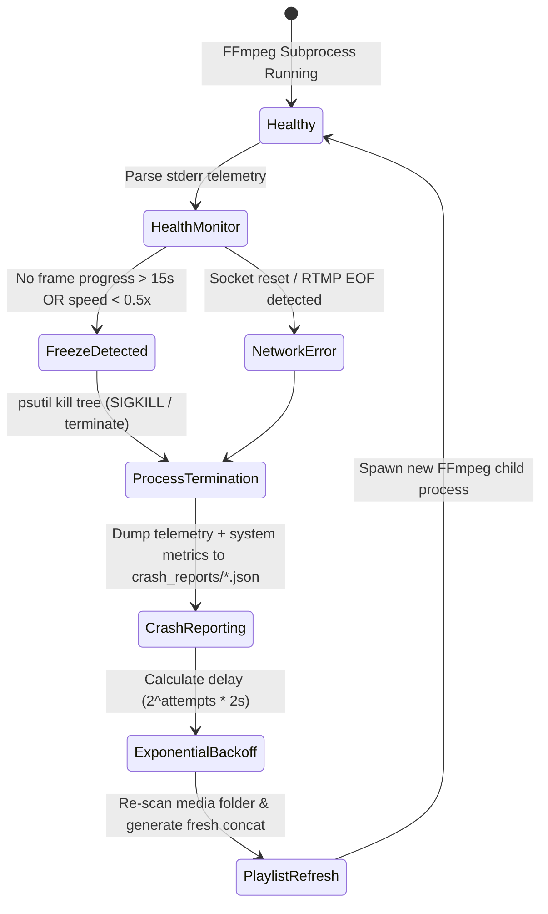

# Mirza Live Server — Automated Recovery & Self-Healing Architecture Guide

**Mirza Live Server** is architected to operate autonomously without human intervention. This guide details the internal self-healing loops, exponential backoff formulas, configuration rollback guarantees, and crash post-mortem diagnostics that protect 24/7 livestreams from network drops, process hangs, and hardware bottlenecks.

---

## 1. Automated Crash & Freeze Recovery Architecture

When an `ffmpeg` encoding subprocess experiences a network interruption (`Broken pipe`, `WSAECONNRESET`, `EOF on socket`) or hangs due to CPU starvation, the server executes a multi-stage automated recovery sequence:



---

## 2. Exponential Backoff Formula (`supervisor.py`)

To prevent rapid-fire process spawning during extended YouTube outages or ISP network blackouts, `ChannelSupervisor` applies an exponential backoff formula:

$$\text{Delay} = \min\left(\text{base\_delay} \times 2^{\text{restart\_count}}, \ \text{max\_backoff}\right)$$

Where:
- $\text{base\_delay} = 2.0\text{ seconds}$
- $\text{max\_backoff} = 60.0\text{ seconds}$

### Backoff Progression Schedule:
| Attempt Number | Computed Delay | Server Action / Status |
| :---: | :---: | :--- |
| **1** | 2.0s | Immediate quick restart after brief network hiccup |
| **2** | 4.0s | Short recovery pause |
| **3** | 8.0s | Moderate pause allowing router / ISP link reset |
| **4** | 16.0s | Extended pause |
| **5** | 32.0s | Extended pause |
| **6+** | 60.0s (Capped) | Sustained retry loop every 60 seconds until upstream recovers |

*Note: If a channel stream runs stably without interruption for more than 5 minutes (`300` seconds), `supervisor.py` automatically resets `restart_count` to zero.*

---

## 3. Atomic Configuration Rollback (`config.yaml.bak`)

To eliminate the risk of corrupted or half-written configuration files during system power loss or abrupt shutdown (`SIGINT` / `CTRL+C`), all configuration write operations (`save_config` in `src/mirza/config/loader.py`) execute atomically:

1. **Automatic Backup**: If `config.yaml` exists, it is immediately copied to `config.yaml.bak` (`shutil.copy2`) before any modifications occur.
2. **Temporary Staging Write**: New configuration data is serialized to `config.yaml.tmp`.
3. **Atomic File Replacement**: `config.yaml.tmp.replace(config.yaml)` is executed. On Windows (`NTFS`) and Linux (`ext4`), file replacement via `Path.replace()` is an atomic filesystem operation. A power cut during write will only affect `.tmp`, leaving `config.yaml` and `config.yaml.bak` completely intact.

### Manual Rollback Procedure:
If a user edits `config.yaml` manually and introduces invalid YAML syntax, rollback instantly using the automated backup:
```powershell
copy config.yaml.bak config.yaml
```

---

## 4. Post-Mortem Crash Traces (`crash_reports/*.json`)

Whenever `ChannelSupervisor` or `Orchestrator` catches an unrecoverable exception or stream stall, a rich JSON diagnostic crash report is automatically generated inside `crash_reports/crash_<channel_id>_<timestamp>.json`.

### Sample Crash Report Structure:
```json
{
  "crash_id": "8f3a9b1c-4d2e-11ee-be56-0242ac120002",
  "timestamp": "2026-07-09T17:10:01.402Z",
  "channel_id": "channel_main",
  "exit_code": 1,
  "restart_reason": "FREEZE_DETECTED",
  "last_media_item": "C:/live_channel/media/main/video_04.mp4",
  "system_metrics": {
    "cpu_percent": 92.4,
    "ram_percent": 84.1,
    "ram_used_mb": 13780.5,
    "ram_total_mb": 16384.0,
    "is_cpu_overloaded": true,
    "is_ram_overloaded": false
  },
  "ffmpeg_stderr_tail": [
    "frame= 4210 fps= 29.9 q=28.0 size= 45120kB time=00:02:20.33 bitrate=4500.0kbits/s speed=0.99x",
    "frame= 4215 fps= 25.1 q=28.0 size= 45200kB time=00:02:20.50 bitrate=4500.1kbits/s speed=0.83x",
    "frame= 4218 fps= 18.0 q=28.0 size= 45250kB time=00:02:20.60 bitrate=4500.0kbits/s speed=0.60x",
    "[rtmp @ 0x224a1] WSAGetLastError: 10054 Connection reset by peer",
    "av_interleaved_write_frame(): Error while opening file"
  ],
  "traceback_str": "Traceback (most recent call last):\n  File \"src/mirza/engine/supervisor.py\", line 188..."
}
```

### Analyzing Crash Reports:
- **Check `restart_reason`**: Identifies whether the crash was caused by `FREEZE_DETECTED`, `NETWORK_INTERRUPTION`, or `FFMPEG_CRASH`.
- **Examine `ffmpeg_stderr_tail`**: Contains the exact last 15 lines of raw FFmpeg output prior to the crash. Look for socket errors or `speed=...x` dropoffs.
- **Inspect `system_metrics`**: If `is_cpu_overloaded` is `true` during the crash timestamp, host CPU starvation caused the FFmpeg encoder loop to stall.
